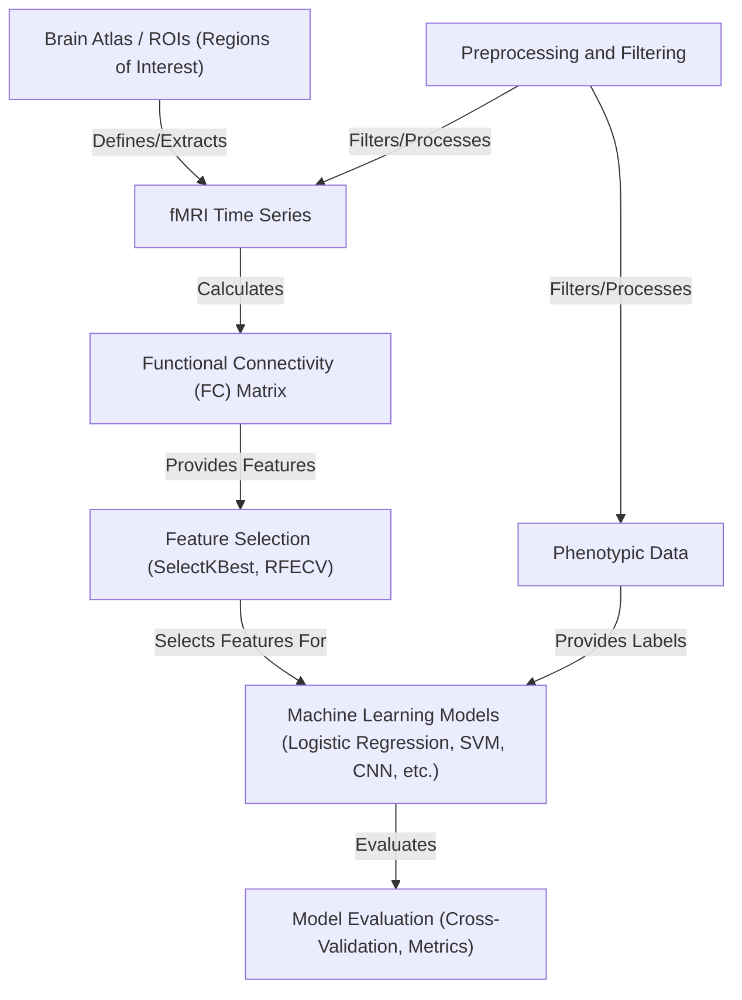

# ASD Project

This project implements an end-to-end rs-fMRI pipeline to build individualized feature maps and normative deviations for Autism Spectrum classification using ABIDE PCP data. It includes atlas-based NIfTI→ROI extraction, dynamic connectivity features, ComBat harmonization, covariate-aware normative modeling, and site-aware cross-validation and model tuning.

## Visual Overview

## Structure

- `asd_pipeline/atlas.py`: NIfTI to ROI time series extraction with `nilearn` (labels/maps).
- `asd_pipeline/preprocess.py`: Confound regression and bandpass cleaning.
- `asd_pipeline/confounds.py`: Motion TSV and WM/CSF tissue signal confound construction.
- `asd_pipeline/features.py`: Static FC, dynamic FC (windowed mean/std), ALFF, k-means state metrics (occupancy, transitions, dwell mean/std, entropy, asymmetry).
- `asd_pipeline/harmonize.py`: Site harmonization via ComBat with age/sex covariates.
- `asd_pipeline/normative.py`: Covariate-aware residualization and MVN-based personalized deviation maps (z-scores, Mahalanobis).
- `asd_pipeline/model.py`: Site-aware CV (Stratified/Group/LOSO/Site-stratified), model tuning (logistic L2, elastic net, calibrated linear SVM), optional normative deviation feature selector.
- `scripts/run_pipeline.py`: CLI to orchestrate atlas extraction, confounds, features, harmonization, normative, and model evaluation.
- `scripts/run_experiments.py`: YAML-driven experiment runner across CV strategies and atlases.
- `tests/`: Unit tests for features, CV, normative, and models.

## Quick Start

- Install dependencies (prefer a virtual env): `python3 -m pip install -r requirements.txt`
- Synthetic sanity check: `python3 scripts/demo_synthetic.py`
- Run unit tests: `python3 -m unittest discover -s tests -p "test_*.py" -v`

## Data Preparation (ABIDE PCP)

- Phenotype CSV must include `SUB_ID`, `SITE`, `DX_GROUP`, `AGE_AT_SCAN`, `SEX`.
  - Labels: `DX_GROUP` expected as `2` for TD, `1` for ASD.
- Provide raw NIfTI per subject as `nifti_dir/SUB_ID.nii.gz` and atlas image at `--atlas`.
- Optional confounds:
  - Motion TSV at `confounds_tsv_dir/SUB_ID_confounds.tsv` (typical motion columns: `trans_*`, `rot_*`, `framewise_displacement`).
  - Tissue masks `--wm_mask` and `--csf_mask` for WM/CSF averaged signals.

## Pipeline Usage

- Atlas extraction + confounds + harmonization + normative + models:
  - `python3 scripts/run_pipeline.py --phenotype phenotype.csv --nifti_dir /path/to/nifti --atlas /path/to/atlas.nii.gz --atlas_type labels --site_col SITE --label_col DX_GROUP --age_col AGE_AT_SCAN --sex_col SEX --tr 2.0 --window_size 50 --step 10 --n_states 5 --cv_strategy site_stratified --tune_models --confounds_tsv_dir /path/to/tsv --wm_mask /path/to/wm_mask.nii.gz --csf_mask /path/to/csf_mask.nii.gz --output pipeline_results.json`

- Outputs include cross-validated metrics per model or per strategy when tuning is enabled.

## Experiment Runner

- Configure experiments in YAML (see `configs/example.yaml`).
- Run multiple CV strategies and log results:
  - `python3 scripts/run_experiments.py --config configs/example.yaml`

## Notes on Features and Normative Modeling

- Static FC: correlation upper triangle (`asd_pipeline/features.py:11`).
- Dynamic FC: windowed FC mean/std (`asd_pipeline/features.py:26`).
- ALFF: low-frequency power per ROI (`asd_pipeline/features.py:40`).
- State metrics: k-means over windowed FC vectors; occupancy, transition probabilities, dwell mean/std, entropy, asymmetry (`asd_pipeline/features.py:87`).
- ComBat: site harmonization with age (continuous) and sex (categorical) covariates (`asd_pipeline/harmonize.py:7`).
- Normative deviations: covariate residualization then MVN fit on TD → per-feature z-scores and Mahalanobis per subject (`asd_pipeline/normative.py:27`).

## Cross-Validation Strategies

- `stratified`: label-stratified folds.
- `group`: `GroupKFold` using `SITE` groups.
- `loso`: `LeaveOneGroupOut` by site.
- `site_stratified`: label-balanced splits stratified within each site and merged (`asd_pipeline/model.py:63`).

## Model Tuning

- `logistic_l2`: `StandardScaler` + `NormDiffSelector` + L2 logistic.
- `logistic_elasticnet`: `StandardScaler` + `NormDiffSelector` + elastic net logistic (solver `saga`).
- `linear_svc_calibrated`: `StandardScaler` + linear SVM calibrated to probabilities.

## Testing

- Feature tests check windowing and state metrics shapes (`tests/test_features.py:9`).
- CV tests validate site-stratified fold label and site coverage (`tests/test_cv.py:1`).
- Normative tests validate z-score and Mahalanobis outputs (`tests/test_normative.py:1`).
- Model tests verify evaluation APIs and metrics (`tests/test_model.py:1`).
