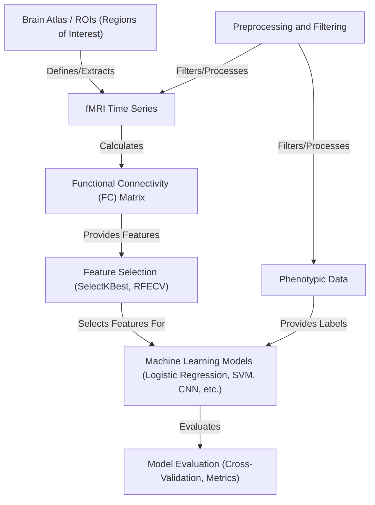

## Project Overview

This project uses **brain imaging data** (fMRI time series) and a **brain map** (atlas/ROIs) to calculate how different brain areas interact (functional connectivity matrix).
This "brain fingerprint" is then combined with **patient information** (phenotypic data), preprocessed, and used to train machine learning models to predict whether someone has ASD.
The project also uses feature selection techniques, to find the most important brain connections for this prediction.

